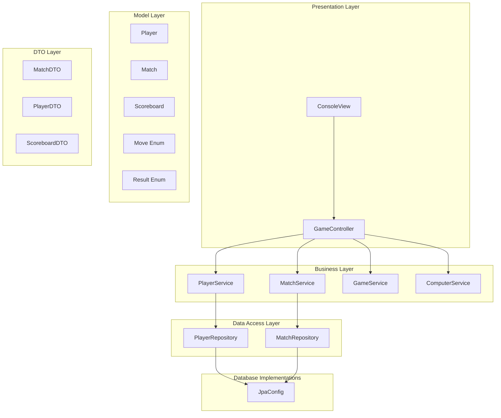
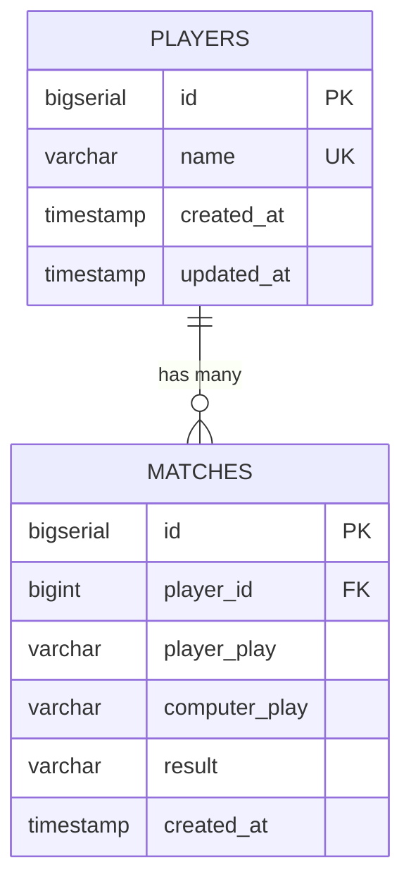

# 🎮 Pedra, Papel e Tesoura - Estudo de Arquitetura Java

<p align="center">
  
  
  
  
  
</p>


## 📋 Sobre o Projeto

Este projeto implementa o clássico jogo **Pedra, Papel e Tesoura** utilizando Java com foco em **arquitetura de software** e **boas práticas de desenvolvimento**.

**⚠️ Importante:** A ideia não foi complicar algo simples, mas sim utilizar uma lógica relativamente básica como laboratório para estudar e aplicar conceitos avançados do Java, incluindo design patterns, arquitetura em camadas, persistência de dados e princípios SOLID.

## 🎯 Objetivos de Aprendizado

### Conceitos Estudados e Aplicados:
- ✅ **Arquitetura em Camadas** (MVC + Service + Repository)
- ✅ **Design Patterns** (Strategy, Factory, Mapper)
- ✅ **Princípios SOLID**
- ✅ **Clean Code** e organização de pacotes
- ✅ **Persistência de Dados** com JDBC
- ✅ **Múltiplos SGBDs** (H2 e PostgreSQL)
- ✅ **DTOs e Mappers** para transferência de dados
- ✅ **Interface Segregation** para flexibilidade de configuração
- ✅ **Dependency Injection** manual
- ✅ **Gerenciamento de configurações** via variáveis de ambiente

## 🏗️ Arquitetura do Sistema



## 📁 Estrutura do Projeto

```
src/main/java/br/com/madda/rock_paper_scissors/
├── 📁 config/                  # Configurações de banco
│   ├── JpaConfig.java
├── 📁 controller/              # Controladores (MVC)
│   └── GameController.java
├── 📁 dto/                     # Data Transfer Objects
│   ├── MatchDTO.java
│   ├── PlayerDTO.java
│   └── ScoreboardDTO.java
├── 📁 mapper/                  # Conversores Entity ↔ DTO
│   ├── MatchMapper.java
│   └── PlayerMapper.java
├── 📁 entity/                # Entidades de domínio
│   ├── Match.java
│   ├── Player.java
│   ├── Scoreboard.java
│   └── enums/
│       ├── Move.java
│       └── Result.java
├── 📁 repository/              # Acesso a dados
│   ├── MatchRepository.java
│   └── PlayerRepository.java
├── 📁 service/                 # Lógica de negócio
│   ├── ComputerService.java
│   ├── GameService.java
│   ├── MatchService.java
│   └── PlayerService.java
├── 📁 view/                    # Interface com usuário
│   └── ConsoleView.java
└── App.java                    # Ponto de entrada
```

## 🛠️ Tecnologias Utilizadas

| Tecnologia | Versão | Propósito |
|-----------|--------|-----------|
| **Java** | 21+ | Linguagem principal |
| **Maven** | 3.8+ | Gerenciamento de dependências |
| **H2 Database** | 2.3.232 | Banco em memória (desenvolvimento) |
| **PostgreSQL** | 42.7.7 | Banco de produção (Neon Cloud) |
| **Hibernate** | 6.4.4.Final | ORM |
| **Flyway** | 10.8.1 | Gerenciamento e controle de migrações |
| **dotenv-java** | 3.2.0 | Gerenciamento de variáveis ambiente |
| **SLF4J** | 2.0.17 | Sistema de logging |

## 🚀 Como Executar

### Pré-requisitos
- ☕ Java 21+ instalado
- 📦 Maven 3.8+ instalado
- 🌐 Conta no [Neon](https://neon.tech) (opcional, para PostgreSQL)

### 1️⃣ Clonar o Repositório
```bash
git clone https://github.com/mrnascimentodev/java-rock-paper-scissors-console-game.git
cd java-rock-paper-scissors-console-game
```

### 2️⃣ Configurar Banco de Dados

#### Opção A: H2 (Zero Configuração)
```bash
# Executa automaticamente com H2 em memória
mvn clean compile exec:java -Dexec.mainClass="br.com.madda.rock_paper_scissors.App"
```

#### Opção B: PostgreSQL Neon
```bash
# 1. Criar arquivo .env na raiz do projeto
echo "DB_URL=jdbc:postgresql://ep-xxx.us-east-1.aws.neon.tech/neondb" > .env
echo "DB_USER=seu_usuario" >> .env
echo "DB_PASSWORD=sua_senha" >> .env

# 2. Migrations
mvn flyway:clean

export $(grep -v '^#' .env | xargs)
mvn flyway:migrate -Dflyway.url=$DB_URL -Dflyway.user=$DB_USER -Dflyway.password=$DB_PASSWORD

# 3. Executar
mvn clean compile exec:java -Dexec.mainClass="br.com.madda.rock_paper_scissors.App"
```

### 3️⃣ Instalar Dependências
```bash
mvn clean install
```

## 🎮 Como Jogar

### Interface do Jogo
```
=================================
  WELCOME TO ROCK PAPER SCISSORS!
=================================

Enter your name: John
Hi, John! Let's play!

--- YOUR HISTORY ---
Victories: 1
Defeats: 5
Draws: 6
Total games: 12

Choose your move:
1 - Rock
2 - Paper
3 - Scissors
Your choice: 1

--- ROUND RESULT ---
You chose: Rock
Computer chose: Rock
Tied!

--- CURRENT SCOREBOARD ---
Player: John
Victories: 1
Defeats: 5
Draws: 7
Total games: 13
Win rate: 7.7%

Do you want to play again? (y/n): n

=================================
         END OF THE GAME!
=================================
--- FINAL STATISTICS ---
The computer was better this time! 🤖
Thanks for playing, Dexter!
Your data has been saved. See you next time!
```

## 🗄️ Estrutura do Banco de Dados

### Diagrama ER


### Tabelas

#### `players`
```sql
CREATE TABLE players (
    id BIGSERIAL PRIMARY KEY,
    name VARCHAR(100) NOT NULL UNIQUE,
    created_at TIMESTAMP DEFAULT CURRENT_TIMESTAMP,
    updated_at TIMESTAMP DEFAULT CURRENT_TIMESTAMP
);
```

#### `matches`
```sql
CREATE TABLE matches (
    id BIGSERIAL PRIMARY KEY,
    player_id BIGINT NOT NULL,
    player_play VARCHAR(20) NOT NULL,
    computer_play VARCHAR(20) NOT NULL,
    result VARCHAR(20) NOT NULL,
    created_at TIMESTAMP DEFAULT CURRENT_TIMESTAMP,
    FOREIGN KEY (player_id) REFERENCES players(id)
);
```

## 🧠 Principais Aprendizados

### 1. **Arquitetura em Camadas**
- Separação clara de responsabilidades
- Baixo acoplamento entre componentes
- Facilita manutenção e testes

### 2. **Design Patterns Aplicados**

#### Strategy Pattern
```java
public enum Move {
    ROCK("Rock"),
    PAPER("Paper"),
    SCISSOR("Scissor");

    public boolean win(Move another) {
        // Lógica específica para cada estratégia
    }
}
```

#### Factory Pattern
```java
public class JPAConfig {
    private static EntityManagerFactory createEntityManagerFactory() {
        String persistenceUnit = isPostgreSQL() ? "postgresql-unit" : "h2-unit";
        // Detecção automática H2 vs PostgreSQL
    }
}
```

### 3. **Princípios SOLID**

- **S**ingle Responsibility: Cada classe tem uma única responsabilidade
- **O**pen/Closed: Aberto para extensão (novos bancos), fechado para modificação
- **L**iskov Substitution: Implementações de DatabaseConfig são intercambiáveis
- **I**nterface Segregation: Interfaces específicas por responsabilidade
- **D**ependency Inversion: Depende de abstrações, não implementações

### 4. **Persistência Multi-SGBD**
- Interface única para múltiplos bancos
- Configuração por variáveis de ambiente
- Detecção automática de ambiente

## 🔧 Configurações Avançadas

### Variáveis de Ambiente
```bash
# Database Settings
# For PostgreSQL (Neon, AWS RDS, etc.)
DB_URL=jdbc:postgresql://host/database
DB_USER=username
DB_PASSWORD=password

# Optional configurations
LOGGING_LEVEL=INFO
JPA_SHOW_SQL=false
HIKARI_MAX_POOL_SIZE=10

# Flyway settings
FLYWAY_BASELINE_ON_MIGRATE=true
FLYWAY_VALIDATE_ON_MIGRATE=true
```

### Maven Profiles
```xml
<!-- Perfil de desenvolvimento -->
<profile>
    <id>dev</id>
    <properties>
        <database.type>h2</database.type>
    </properties>
</profile>

<!-- Perfil de produção -->
<profile>
    <id>prod</id>
    <properties>
        <database.type>postgresql</database.type>
    </properties>
</profile>
```

## 🧪 Testes

### Executar Testes
```bash
mvn test
```

### Cobertura de Testes
```bash
mvn jacoco:report
```

## 📊 Funcionalidades

### Core Features
- ✅ Jogo completo Pedra, Papel e Tesoura
- ✅ Persistência de jogadores
- ✅ Histórico completo de partidas
- ✅ Estatísticas detalhadas
- ✅ Taxa de vitória calculada

### Technical Features
- ✅ Arquitetura multi-camadas
- ✅ Suporte a múltiplos SGBDs
- ✅ Detecção automática de ambiente
- ✅ DTOs para transferência de dados
- ✅ Mappers para conversão de objetos
- ✅ Tratamento de erros robusto

## 🚦 Próximos Passos

### Melhorias Planejadas
- [X] Implements JPA and Flyway
- [ ] Testes completos
- [ ] CI/CD pipeline
- [ ] Diferentes níveis de dificuldade da IA

## 🤝 Contribuições

Contribuições são bem-vindas! Por favor:

1. Faça um fork do projeto
2. Crie uma branch para sua feature (`git checkout -b feature/AmazingFeature`)
3. Commit suas mudanças (`git commit -m 'Add some AmazingFeature'`)
4. Push para a branch (`git push origin feature/AmazingFeature`)
5. Abra um Pull Request

## 📝 Licença

Este projeto está sob a licença MIT. Veja o arquivo `LICENSE` para mais detalhes.

## 👨‍💻 Autor

**Seu Nome**
- GitHub: [@mrnascimentodev](https://github.com/mrnascimentodev)
- LinkedIn: [@marcosnascimento](https://www.linkedin.com/in/marcosnascimento)
- Email: mrnascimento.dev@gmail.com

---

<p align="center">
  ⭐ Se este projeto te ajudou nos estudos, considere dar uma estrela!
</p>

<p align="center">
  <i>Desenvolvido com ☕ e muito aprendizado em Java</i>
</p>
